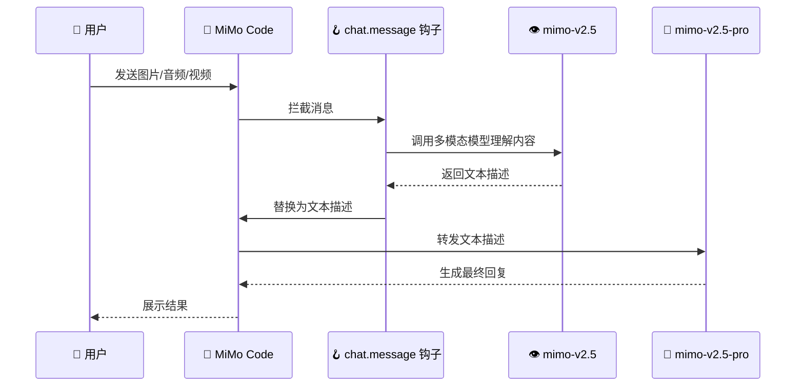
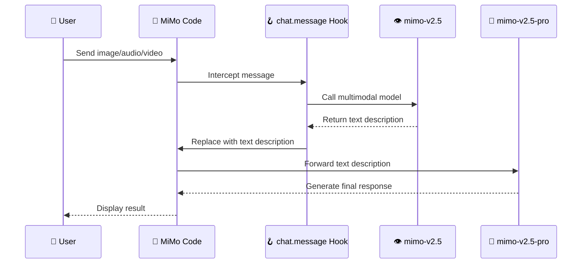

# MiMo-Multimodal-Bridge

[English](#english) | [中文](#中文)

---

## 中文

MiMo 多模态桥接插件 - 让不支持多模态的模型（如 mimo-v2.5-pro）能够理解图片、音频、视频内容。

**兼容平台**: MiMo Code / OpenCode

### 功能特性

- 🖼️ **图片理解** - 代码截图、图表、错误信息
- 🎵 **音频转录** - 语音内容识别
- 🎬 **视频描述** - 场景和动作理解
- 📄 **PDF 提取** - 文档内容提取

### 工作原理



**核心机制**：基于 `@mimo-ai/plugin` 官方插件 API，通过 `chat.message` 钩子自动拦截多模态内容。当检测到用户发送了图片、音频或视频时，自动调用 mimo-v2.5 模型进行预处理，将结果转为文本描述后传递给主模型，实现跨模型能力扩展。

### 技术实现

- 使用 `chat.message` 钩子在消息到达模型前自动拦截多模态内容
- 拦截后调用 `client.session.prompt()` 将内容发送给 mimo-v2.5 模型
- mimo-v2.5 返回的文本描述替换原始的文件部分
- 同时注册 `understand_media` 工具供模型主动调用
- 本地文件自动转为 base64 data URL，支持 `file://` 协议和相对路径

### 安装

#### 快速安装（推荐）

```bash
# Linux/Mac
curl -fsSL https://raw.githubusercontent.com/will00768-max/MiMo-Multimodal-Bridge/main/install.sh | bash

# Windows (PowerShell)
irm https://raw.githubusercontent.com/will00768-max/MiMo-Multimodal-Bridge/main/install.ps1 | iex
```

#### 手动安装

1. **下载插件**：
   ```bash
   git clone https://github.com/will00768-max/MiMo-Multimodal-Bridge.git
   cd MiMo-Multimodal-Bridge
   ```

2. **复制到插件目录**：
   
   **MiMo Code 用户**：
   ```bash
   # Linux/Mac
   mkdir -p ~/.config/mimocode/plugins/mimo-multimodal-bridge
   cp index.ts plugin.json ~/.config/mimocode/plugins/mimo-multimodal-bridge/

   # Windows
   mkdir %APPDATA%\mimocode\plugins\mimo-multimodal-bridge
   copy index.ts plugin.json %APPDATA%\mimocode\plugins\mimo-multimodal-bridge\
   ```

   **OpenCode 用户**：
   ```bash
   # Linux/Mac
   mkdir -p ~/.config/opencode/plugins/mimo-multimodal-bridge
   cp index.ts plugin.json ~/.config/opencode/plugins/mimo-multimodal-bridge/

   # Windows
   mkdir %APPDATA%\opencode\plugins\mimo-multimodal-bridge
   copy index.ts plugin.json %APPDATA%\opencode\plugins\mimo-multimodal-bridge\
   ```

3. **添加配置**：
   
   编辑配置文件：
   - MiMo Code: `~/.config/mimocode/mimocode.json`
   - OpenCode: `~/.config/opencode/opencode.json`
   
   ```json
   {
     "plugin": [
       "~/.config/mimocode/plugins/mimo-multimodal-bridge/index.ts"
     ]
   }
   ```

4. **重启 MiMo Code / OpenCode**

详细安装说明请参考 [INSTALL-GLOBAL.md](./INSTALL-GLOBAL.md)

### 使用方法

安装后，当遇到不支持的多模态内容时，模型会自动调用 `understand_media` 工具。

**示例**：
```
用户: [发送代码截图] 这段代码有什么错误？

模型: 我来查看这张图片...
[自动调用 understand_media 工具]

工具返回: 这是一段 Python 代码截图：
```python
def calculate(a, b)
    return a + b
```
函数定义缺少冒号...

模型: 根据图片内容，你的代码在函数定义行缺少冒号，应该是：
```python
def calculate(a, b):
    return a + b
```
```

### 支持的媒体类型

| 类型 | MIME 类型 | 说明 |
|------|-----------|------|
| 图片 | image/* | PNG, JPEG, GIF, WebP 等 |
| 音频 | audio/* | WAV, MP3 等 |
| 视频 | video/* | MP4, WebM 等 |
| PDF | application/pdf | PDF 文档 |

### 配置选项

插件使用以下默认配置：
- **多模态模型**: `mimo/mimo-v2.5`
- **调用方式**: `client.session.prompt()`（复用当前会话）
- **文件处理**: 本地文件自动转为 base64 data URL

如需使用其他多模态模型，可修改 `index.ts` 中的 `model` 字段。

### 升级兼容性

- ✅ 不修改核心代码
- ✅ 官方升级无影响
- ✅ 插件接口向后兼容
- ✅ 同时支持 MiMo Code 和 OpenCode

### 已知限制

- 需要能够访问支持多模态的模型（如 mimo-v2.5）
- 处理大文件时可能较慢
- 音频/视频理解能力取决于底层模型

### 开发计划

- [ ] 支持自定义多模态模型配置
- [ ] 支持批量处理多个媒体文件
- [ ] 缓存已处理的内容
- [ ] 支持更多模型提供商

### 许可证

MIT

---

## English

MiMo Multimodal Bridge Plugin - Enable text-only models (like mimo-v2.5-pro) to understand images, audio, and video content.

**Compatible with**: MiMo Code / OpenCode

### Features

- 🖼️ **Image Understanding** - Code screenshots, charts, error messages
- 🎵 **Audio Transcription** - Speech content recognition
- 🎬 **Video Description** - Scene and action understanding
- 📄 **PDF Extraction** - Document content extraction

### How It Works



**Core Mechanism**: Based on the official `@mimo-ai/plugin` API, uses a `chat.message` hook to automatically intercept multimodal content. When images, audio, or video are detected, it calls mimo-v2.5 for preprocessing, converts the result to text description, and passes it to the primary model, enabling cross-model capability extension.

### Installation

#### Quick Install (Recommended)

```bash
# Linux/Mac
curl -fsSL https://raw.githubusercontent.com/will00768-max/MiMo-Multimodal-Bridge/main/install.sh | bash

# Windows (PowerShell)
irm https://raw.githubusercontent.com/will00768-max/MiMo-Multimodal-Bridge/main/install.ps1 | iex
```

See [INSTALL-GLOBAL.md](./INSTALL-GLOBAL.md) for detailed installation instructions.

### Usage

After installation, when encountering unsupported multimodal content, the model will automatically call the `understand_media` tool.

### Supported Media Types

| Type | MIME Type | Description |
|------|-----------|-------------|
| Image | image/* | PNG, JPEG, GIF, WebP, etc. |
| Audio | audio/* | WAV, MP3, etc. |
| Video | video/* | MP4, WebM, etc. |
| PDF | application/pdf | PDF documents |

### License

MIT
